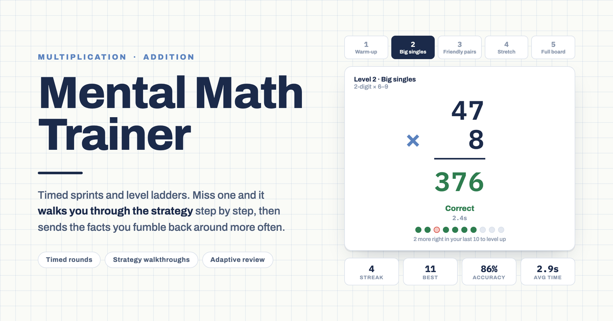

# Mental Math Trainer

_Timed arithmetic drills that teach you the trick when you miss one._


I wanted something that did more than mark me wrong. If I miss `84 x 9`, being
told the answer is 756 teaches me nothing — I want to be shown that 84 splits
into 80 + 4, and then be made to do both halves myself. So the app does that:
every miss on a ladder drill turns into a named strategy and a set of sub-steps
you have to answer.

It is a small single-page app behind sign-in, with per-user stats synced to
Postgres so a phone and a laptop see the same history.

## The four drills

| Drill | What it does |
|---|---|
| Times-table sprint | 20 single-digit facts (2–9, both orders tracked separately) against the clock |
| Two-digit multiplication ladder | Five levels, from `2-digit x 2–5` up to `2-digit x 2-digit` |
| Number bonds sprint | 20 single-digit sums, timed the same way |
| Two-digit addition ladder | Five levels, up to three-digit sums with carries |

Both sprints and both ladders share the same keypad, the same keyboard
handling (digits, backspace, enter) and the same clock, which starts when you
press **Start**, not when the page loads.

## How the sprints pick problems

Each fact carries three numbers: how many times you have seen it, how many
times you missed it, and an exponentially weighted average of your answer time
(`0.6 * old + 0.4 * latest`). Every problem is drawn from a weighted sample
over all 64 ordered facts:

- base weight 1, plus up to 5 more in proportion to your miss rate on that fact
- plus up to 2.5 more if that fact's average time is above your global average
- plus up to 2 more for facts you have seen least, so coverage stays even
- unseen facts get a high starting weight so new facts surface early

Miss a fact and it is queued to come back twice — once 2–4 problems later, once
7–10 later. Answer one correctly but slowly — over 1.6x your round average, and
never under 3 seconds — and it is queued once, 4–7 problems later. Requeued problems are labelled
**Review** when they reappear.

At the end of a 20-problem round you get the round's average and accuracy, the
problems you missed, your three slowest correct answers, the facts getting
extra reps next round, and an 8x8 heat map of every fact you can flip between
attempts, average time and misses.

Fat-fingered the keypad? A wrong answer offers **Just a typo — count it
correct**, which records the attempt as correct but keeps your real time.

## How the ladders teach

The ladders are not timed rounds — they run until you leave. Clear 8 of your
last 10 and you move up a level; you can also jump to any level directly.

Miss one and instead of the answer you get a walkthrough. The strategy is
chosen from the shape of the numbers, not from a lookup table:

- **Multiplication** — anchor on 100, drop the zero, split the tens, x10 plus
  the rest, round up and back off, split into tens and ones
- **Addition** — just the ones, bridge through ten, tens jump, round and
  adjust, tens then ones, left to right (for three-digit sums)

Each walkthrough names the strategy, explains it in one sentence with your
actual numbers in it, and then asks you to answer each sub-step. Miss a
sub-step twice and it is revealed and marked, so the trail shows which parts
you got and which you were given. There is a **Reveal all** escape hatch.

## How it is put together

- **Next.js 16 App Router** on Vercel. One page.
- `components/MentalMathTrainer.jsx` is the whole app — drill logic, layout and
  CSS in a single self-contained component, loaded client-side only (it seeds
  its first problem with `Math.random`, so server rendering would fail
  hydration).
- **Clerk** protects every route via `proxy.ts`. There is no signed-out view.
- The component talks to a small async `window.storage` key/value API. In this
  build `lib/storage-client.ts` installs an implementation backed by
  `/api/storage/[key]`, which scopes every read and write to the Clerk user id.
  Only the sprints persist (their fact stats and round history); ladder
  progress is per-session.
- **Neon Postgres** holds one table:

  ```sql
  CREATE TABLE IF NOT EXISTS user_storage (
    user_id     TEXT NOT NULL,
    key         TEXT NOT NULL,
    value       TEXT NOT NULL,
    updated_at  TIMESTAMPTZ NOT NULL DEFAULT now(),
    PRIMARY KEY (user_id, key)
  );
  ```

On first load, if the server has nothing for a key but this browser's
`localStorage` does — either the bare key or an `mmt:`-prefixed one from the
original artifact build — the local value is uploaded once, so old stats carry
over.

`PROMPT.md` is the brief I started from, kept as-is.

## Running it locally

```sh
npm install
cp .env.example .env.local   # fill in the three values below
npm run db:init              # creates the user_storage table
npm run dev
```

Then open http://localhost:3000 and sign in through Clerk.

### Environment variables

| Name | Where it comes from |
|---|---|
| `NEXT_PUBLIC_CLERK_PUBLISHABLE_KEY` | Clerk dashboard, API keys |
| `CLERK_SECRET_KEY` | same place |
| `DATABASE_URL` | Neon connection string |

Both can be provisioned through the Vercel Marketplace, which writes the env
vars for you:

```sh
vercel integration add clerk
vercel integration add neon
```

## Deploying

```sh
vercel link
vercel env pull        # or set the three variables in the dashboard
vercel --prod
```

Run `npm run db:init` once against the production `DATABASE_URL` before the
first signed-in visit.
